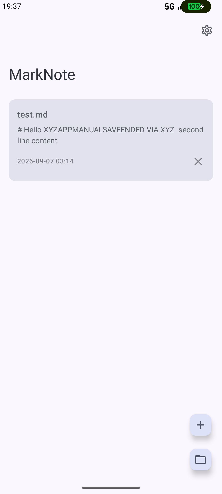
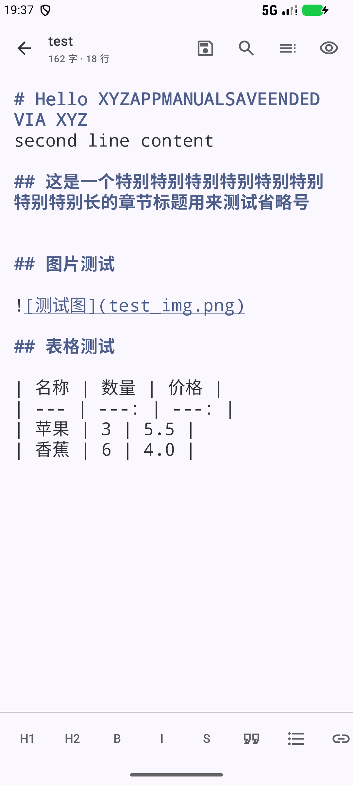
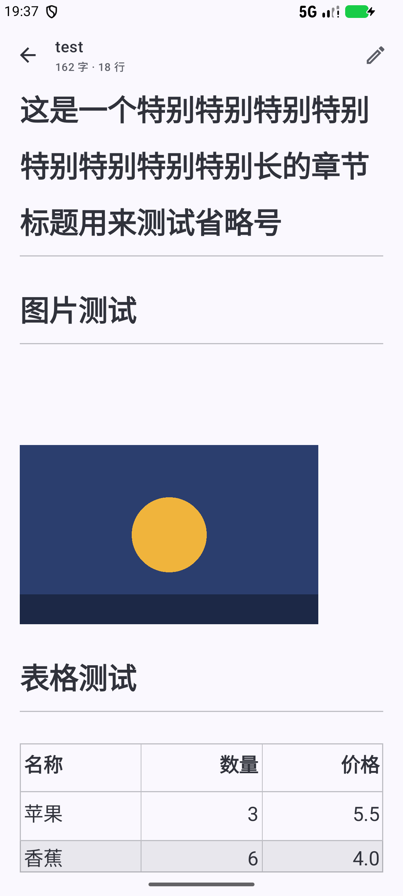
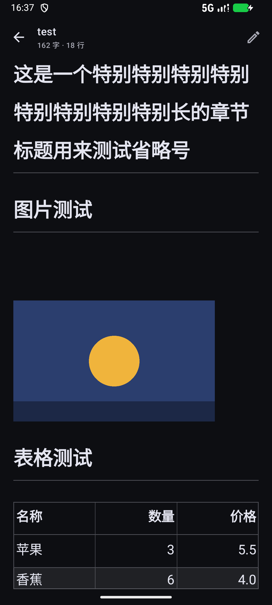
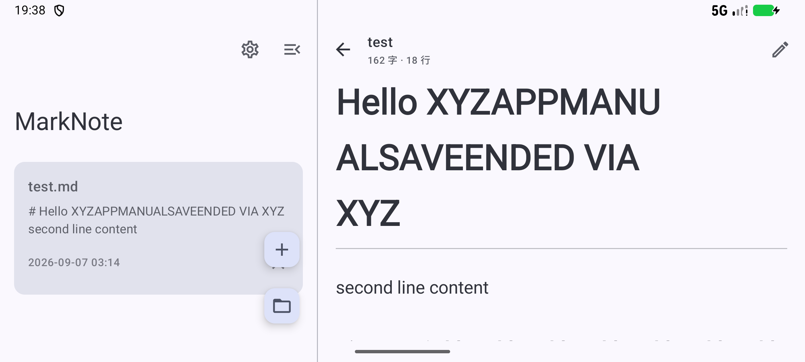

# MarkNote

A lightweight Android Markdown editor · file-first · Kotlin + Jetpack Compose + Material 3

**English** | [简体中文](README.zh-CN.md)

<p>
  
  
  
  
  
</p>

MarkNote is a **file-first** Markdown editor: it keeps no private note database — it reads and writes `.md` files anywhere on your device. Tap a `.md` file in a file manager and pick MarkNote; your edits are saved back to the original location.

## Download

Grab the latest APK (`MarkNote-vX.Y.Z.apk`) from [Releases](https://github.com/groundgrounder/MarkNote/releases). minSdk 26 (Android 8.0+).

## Features

**Files**

- Open straight from a file manager: registers VIEW/EDIT intents for `text/markdown` / `text/plain` / `.md` / `.markdown`, so MarkNote appears in the system "Open with" sheet (singleTask — reopening reuses the same instance)
- Read/write any folder via SAF: open or create with the system document picker, no storage permission needed, edits are written back to the original file
- Recent files with persisted permission: keep editing after a restart; entries can be removed without touching the file; unavailable files are marked in red with a one-tap "Re-authorize"
- Permission source warning: files handed over by other apps (file manager "Open with", chat history, …) usually cannot be granted persistent access — FileProvider and MediaStore do not support it. MarkNote says so immediately and walks you through re-picking the same file in the system picker to obtain a lasting grant
- Read-only notice: without write access the editor shows "changes will not be saved" instead of silently dropping your edits
- Auto-save: writes to disk 800 ms after you stop typing, and forcibly saves before leaving the editor or switching to preview; can be switched to manual (the save button in the top bar highlights while there are unsaved changes)

**Editing**

- Syntax highlighting in the editor: lightweight and regex-based — headings, bold, italic, strikethrough, quotes, code, links and list markers are coloured live
- Symbol toolbar: H1/H2/B/I/S plus quote / list / link / code / horizontal rule, docked above the keyboard, wraps the current selection
- Search & replace: match counter (n/m), wrapping navigation with highlighted matches, replace one or all
- Outline navigation: slides in from the right on landscape/tablet, bottom sheet on narrow screens; tapping jumps to the heading (available in preview too)
- Word count: live "N chars · M lines" in the top bar

**Preview**

- One-tap toggle, rendered with Markwon; supports GFM tables (header, zebra striping, column alignment), strikethrough and tappable links
- Search and outline work in the read-only preview as well: search runs over the **rendered output** (what you see is what you search), every match is highlighted, the current one is solid and scrolled into view, with an n/m counter and up/down navigation; tapping an outline entry scrolls the body to that heading. Preview is read-only, so there is no replace
- Images: relative-path images need a one-time folder grant — tap "Grant access" in the banner and pick the folder holding the document (the grant is persistent); `content://`, `file://` and base64 data URIs are supported; oversized images are downsampled to avoid OOM

**UI & adaptation**

- Material You: dynamic colour on Android 12+, light/dark can follow the system or be locked manually, edge-to-edge layout
- Tablet / landscape two-pane: wide screens (≥840dp) switch automatically to a file list on the left and the editor on the right, live on rotation; the sidebar collapses to a narrow strip
- Settings: theme mode, app language, independent font sizes for editor and preview, auto-save switch
- Localization: 9 built-in languages — English, Simplified Chinese, Traditional Chinese, Japanese, French, German, Spanish, Italian and Latin; follows the system by default and can be pinned in Settings, applying immediately; unmatched languages (Korean, Portuguese, …) fall back to English
- System language entry point: declares `android:localeConfig`, so on Android 13+ the UI language can also be changed from system Settings → Apps → MarkNote → Language, kept in sync with the in-app picker

## Localization

Every UI string lives in `app/src/main/res/values*/strings.xml`, and the code reads them only through `stringResource(...)` (Compose) or `context.getString(...)` (repositories).

| Directory | Language |
|---|---|
| `values/` | English (default directory, fallback for unmatched locales) |
| `values-en/` | English (same content as the default directory; declared explicitly so `localeConfig` has an owner for `en`) |
| `values-b+zh+Hans/` | Simplified Chinese (BCP 47 script qualifier — matches zh-CN / zh-SG / zh-Hans-*) |
| `values-b+zh+Hant/` | Traditional Chinese (BCP 47 script qualifier — matches zh-TW / zh-HK / zh-MO) |
| `values-ja/` | 日本語 |
| `values-fr/` | Français |
| `values-de/` | Deutsch |
| `values-es/` | Español |
| `values-it/` | Italiano |
| `values-la/` | Latina |

The timestamp format in the recent-files list follows the language too (generated from the ICU skeleton `yMdHm` per locale).

Language switching deliberately does **not** pull in AppCompat — the app theme extends `android:Theme.Material.NoActionBar`, so `AppCompatDelegate.setApplicationLocales` is unavailable. It is implemented in-house instead: an `AppLanguage` enum plus a language preference in SharedPreferences, with the Activity recreated on change. Two context wrappers do the real work, and both are required:

- `MainActivity.attachBaseContext` — wraps the Activity context so `stringResource` inside Compose resolves to the target language
- `MarkNoteApplication.getResources()` — resolves dynamically against the current preference, so `applicationContext` (used by the repository layer for strings) follows the language as well, without restarting the process

Those two wrappers are the entire mechanism, which makes it **API-level independent** — Android 8.0+ throughout.

Android 13+ adds a second channel: with `android:localeConfig` declared in `AndroidManifest` (pointing at `res/xml/locales_config.xml`), MarkNote shows up in system Settings → Apps → Language. `AppLocaleStore` keeps the two sides aligned:

- Set in the system → the system wins, and the value is written back to the local preference so the in-app "Language" row follows
- Not set in the system (follow system) → the local preference is used, keeping in-app switching reliable on every device

`AppLocaleStore` keeps an **in-process cache** of the resolved language: `MarkNoteApplication.getResources()` is called extremely often, while querying the system per-app language is an IPC round trip, so it cannot be asked on every call. The cache is refreshed in `MainActivity.attachBaseContext` (changing the language in system settings always recreates the Activity) and on every write.

### Adding a language

1. Create `res/values-xx/strings.xml` and translate every string from `values/strings.xml` (currently 80) — **key names must match exactly**
2. Add an entry to the `AppLanguage` enum in `data/AppLanguage.kt`: `tag` is the BCP 47 tag, `endonym` is the language's own name
3. Add `<locale android:name="xx" />` to `res/xml/locales_config.xml`, otherwise it will not appear in the Android 13+ system language list
4. Build — the language list in Settings picks it up automatically

The Chinese variants are tagged by BCP 47 **script** (`zh-Hans` / `zh-Hant`) with the resource directories `values-b+zh+Hans` / `values-b+zh+Hant`, so a single translation covers several regions sharing the same script, instead of one copy per region.

## Tech stack

| Item | Choice |
|---|---|
| Language | Kotlin 2.0 |
| UI | Jetpack Compose + Material 3 (edge-to-edge, LargeTopAppBar) |
| Markdown rendering | Markwon 4.6.2 (core + ext-strikethrough + ext-tables + image), embedded via AndroidView |
| Architecture | MVVM (ViewModel + Compose State), single Activity with lightweight state-based navigation |
| Storage | SAF + SharedPreferences (recent list and settings), no storage permission |
| Localization | In-house (no AppCompat): `AppLanguage` enum + `attachBaseContext` / `getResources` wrappers + 9 sets of `values-*/strings.xml`; Android 13+ hooks into the system per-app language via `android:localeConfig` |
| Compatibility | minSdk 26 / targetSdk 35 |

## Build

```bash
./gradlew assembleDebug        # requires JDK 17+ and the Android SDK (sdk.dir in local.properties)
```

Output: `app/build/outputs/apk/debug/app-debug.apk`. You can also open this directory directly in Android Studio.

GitHub Actions is configured: pushing to main builds the app and uploads the APK as an artifact; pushing a `v*` tag creates a Release with the APK attached.

## Project structure

```
app/src/main/java/com/marknote/app/
├── MainActivity.kt              # entry point + external open intents + lightweight navigation + app-language wrapper
├── MarkNoteApplication.kt       # makes applicationContext resources follow the in-app language
├── data/
│   ├── DocumentRepository.kt    # SAF document I/O + recent list + image folder grants
│   ├── SettingsRepository.kt    # settings (SharedPreferences + Compose state)
│   └── AppLanguage.kt           # language enum / persistence (incl. system per-app language sync) / context wrapper
└── ui/
    ├── theme/Theme.kt           # M3 dynamic colour theme (supports locking light/dark)
    ├── common/                  # document picker, context extensions and other shared pieces
    ├── files/                   # recent files screen + ViewModel
    ├── settings/                # settings screen (incl. language picker)
    └── editor/                  # editor screen, toolbar, syntax highlighting, outline, Markwon preview
```

There is also `app/src/main/res/xml/locales_config.xml` — the list of languages offered by the Android 13+ system "App language" screen, referenced by `android:localeConfig` in the manifest.

## Icon

Adaptive icon: the Markdown "M↓" mark — a white M with an amber down arrow (#FFD54F) on an indigo background (#4A5ACF); supports Android 13+ themed icons (monochrome). The density-specific PNGs are generated by `tools/render_icon.py`.

## Roadmap

- v1.1: "Save as", image insertion
- v2.0: WebDAV sync, custom themes, multi-tab editing

<details>
<summary>Version history</summary>

### v0.11.0

- Fallback language is now English: the default resource directory `values/` switched from Simplified Chinese to English, and Simplified Chinese moved to `values-b+zh+Hans/` (BCP 47 script qualifier). Languages that previously fell through now see English instead of Chinese
- Added `res/xml/locales_config.xml` and declared `android:localeConfig` in the manifest, so Android 13+ users can switch the UI language from system Settings → Apps → MarkNote → Language
- In-app selection and the system per-app language are synced both ways: `AppLocaleStore` keeps both ends aligned and caches the language in-process (`getResources()` is called very frequently, so an IPC query per call is not acceptable)
- Chinese tags moved from region to script (`zh-CN` → `zh-Hans`, `zh-TW` → `zh-Hant`), with backwards compatibility for region tags persisted by older versions

### v0.10.0

- Localization: new "Language" setting with 9 built-in UI languages — Simplified Chinese, Traditional Chinese, English, Japanese, French, German, Spanish, Italian and Latin; follows the system by default and shows each language by its own endonym
- All UI strings moved out of Kotlin into `strings.xml` (80 strings × 9 locales), and the code now reads them via `stringResource` / `getString`
- Switching applies immediately and keeps the current screen and the document being edited; timestamp formatting in the recent list follows the language as well
- No AppCompat (the theme extends `android:Theme.Material.NoActionBar`), so switching is implemented in-house with `attachBaseContext` + `Application.getResources`

### v0.9.0

- Search and outline now work in the read-only preview: previously the preview top bar kept only edit/preview and hid both entrances. Both are available in preview now — search runs over the **rendered output** (what you see is what you search), all matches are lightly highlighted with the current one solid and scrolled into view, plus an n/m counter and up/down navigation; tapping an outline entry scrolls the body straight to that heading (bottom sheet on narrow screens / right panel on wide ones). Preview is read-only, so no replace
- Preview body avoids the keyboard: the IME no longer covers matches while searching
- Shortened the "This file cannot be accessed long-term" dialog (two 90-character paragraphs → one 41-character paragraph), dropping the explanation the buttons already carry

### v0.8.1

- Fixed "file not found after reopening the app": `content://` URIs handed over by external apps mostly cannot be granted persistent access (neither FileProvider nor MediaStore supports it) — the failure used to be swallowed and the grant died with the process. It is now reported immediately, with a prompt to re-pick the same file through the system picker to get a durable URI
- Write access is checked when opening: a read-only grant (or a failed save) shows a banner plus "Re-authorize" in the editor instead of silently losing changes
- Read failures are no longer disguised as empty documents: there is an explicit error screen (Re-authorize / Retry / Back), and writing is disabled while the read failed so empty content cannot overwrite the original file
- The recent list now stores JSON (URI, file name, timestamp, image folder grants): entry times and ordering are no longer lost, entries no longer only grow, re-authorizing replaces the old entry automatically, and stale entries no longer show up as resource ids (e.g. "72")

### v0.8.0

- Images in preview: relative-path images are resolved through a custom scheme + an SAF tree grant (a one-time banner appears at the top of the preview — tap "Grant access" and pick the folder holding the document; the grant is persistent); supports content://, file:// and data: base64 inline images; images larger than 4096 px are downsampled
- GFM table rendering in preview (markwon ext-tables), with header, zebra striping and column alignment

### v0.7.2

- Unified the home-screen floating buttons: "Open file" lost its label and became a small icon-only FAB matching "New" (folder icon); the two are stacked vertically in the same colour scheme

### v0.7.1

- Landscape/tablet fixes: 176dp bottom padding in the sidebar list so file cards are no longer covered by the new/open FABs; long outline titles are ellipsized on a single line instead of squeezing the panel
- Wide-screen interaction fix: tapping a file on the left (or opening from a file manager) while Settings is open now correctly switches the right pane back to the editor
- Settings screen now leaves room for the gesture navigation bar

### v0.7.0

- New Settings screen: theme mode (system/light/dark), independent font size for editor and preview (small/normal/large), auto-save switch, and version info

### v0.6.2

- Dark mode fix: the theme sets `forceDarkAllowed=false` explicitly to stop ROMs (MIUI/HyperOS etc.) from force-inverting the dark UI and turning the editor white; added a values-night theme variant so cold starts in dark mode no longer flash white

### v0.6.1

- UI consistency: all icons switched to Outlined, the outline uses a dedicated Toc icon (no longer clashing with the list icon), the secondary theme colour matches the icon family (indigo), the toolbar avoids the gesture navigation bar and collapsing the sidebar avoids the status bar
- Bug fixes: serialized save coroutines (so stale content cannot overwrite newer content), correct selection/counter after search & replace, the list summary refreshes after returning from the editor, preview links are tappable, and file-name lookups are cached

### v0.5.0

- Collapsible left sidebar, right-hand outline panel on wide screens, symbol toolbar

### v0.4.0

- Two-pane layout, centred max-width, grid list on wide screens

### v0.3.0

- Word count, search & replace

### v0.2.0

- Editor syntax highlighting, outline navigation; Compose BOM upgraded to 2024.12.01 (fixes BottomSheet misplacement after the keyboard)

### v0.1.0 (MVP)

- Plain source editing with a preview toggle, Markwon rendering, file management, auto-save, Material You theming

</details>
